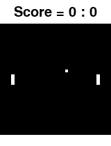

# Competitive Pong Environment



Competitive Pong environment is used for course assignment in IERG6130. This environment was originally developed by Belly Ho and Joe Lam, undergraduate students at CUHK, as their Final Year Project (FYP) with Prof. Zhou Bolei. Course TA Peng Zhenghao modified the environment to aggregate it into the assignment.

## Installation

```bash
git clone https://github.com/cuhkrlcourse/competitive-pong.git
cd competitive-pong
pip install -e .  # Install the package in-place
```

## Usage

Create the environment after registration:

```python
import gym
import competitive_pong

competitive_pong.register_tournament_envs()

env_single = gym.make("CompetitivePong-v0")

env_single.observation_space  # Box(210, 160, 3)
env_single.action_space  # Discrete(3)

env_double = gym.make("CompetitivePongDouble-v0")

env_double.observation_space  # Tuple(Box(210, 160, 3), Box(210, 160, 3))
env_double.action_space  # Tuple(Discrete(3), Discrete(3))
```

Action 0 represents "moving the left bat up", 1 for "no operation" and 2 for "moving the left bat down".

In `CompetitivePongDouble-v0` environment, both agents receive observations shows that they are controlling the left bat. Namely the observation for second agent (the right-side agent) is mirrored. This design guarantees the agent trained by playing with rule-based agent controlling the left bat can smoothly be evaluated with other agents, even when it controls the right-side bat in reality.

## Visualize builtin agents

We provide a set of trained agents to serve as opponents. We prepared 6 level builtin agents, including:

1. `RANDOM` - A random agent
2. `RULE_BASED` - Rule-based agent that serves as the right-side agent in `CompetitivePong-v0`
3. `WEAK` - Weak-level agent with a smaller neural network than yours
4. `MEDIUM` - Medium-level agent with a small neural network
5. `STRONG` - Strong-level agent with a large neural network as yours
6. `ALPHA_PONG` - Boss-level agent that is well trained and may hard to beat down, use a large neural network as yours

You can visualize the performance of arbitrary builtin agents and let them play against each other. Run the script:

```bash
# RULE_BASED agent VS RULE_BASED agent
python vis.py

# ALPHA_PONG agent vs STRONG agent
python vis.py --left ALPHA_PONG --right STRONG --num-episodes 3
```


-----
2019-2020 2nd term, IERG 6130: Reinforcement Learning and Beyond. Department of Information Engineering, The Chinese University of Hong Kong. Course Instructor: Professor ZHOU Bolei. Assignment author: PENG Zhenghao.