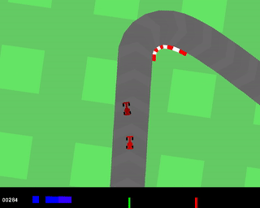

<br><br><br><br>

# Competitive RL Environments

In this repo, we provide two interesting competitive RL environments:

1. Competitive Pong (cPong): extends the classic Atari Game Pong into a competitive environment, where both side can be trainable agents.
2. Comprtitive Car Racing (cCarRacing): The environment that allow multiple vehicles to run in the same map.


## Installation

```bash
pip install git+https://github.com/cuhkrlcourse/competitive-rl.git
```


## Usage

```python
import gym
import competitive_rl

competitive_rl.register_competitive_envs()

pong_single_env = gym.make("cPong-v0")
pong_double_env = gym.make("cPongDouble-v0")

racing_single_env = gym.make("cCarRacing-v0")
racing_double_env = gym.make("cCarRacingDouble-v0")
```

The observation spaces:

1. `cPong-v0`: `Box(210, 160, 3)`
2. `cPongDouble-v0`: `Tuple(Box(210, 160, 3), Box(210, 160, 3))`
3. `cCarRacing-v0`: `Box(96, 96, 1)`
4. `cCarRacingDouble-v0`: `Box(96, 96, 1)`

The action spaces:

1. `cPong-v0`: `Discrete(3)`
2. `cPongDouble-v0`: `Tuple(Discrete(3), Discrete(3))`
3. `cCarRacing-v0`: `Box(2,)`
4. `cCarRacingDouble-v0`: `Dict(0:Box(2,), 1:Box(2,))`
